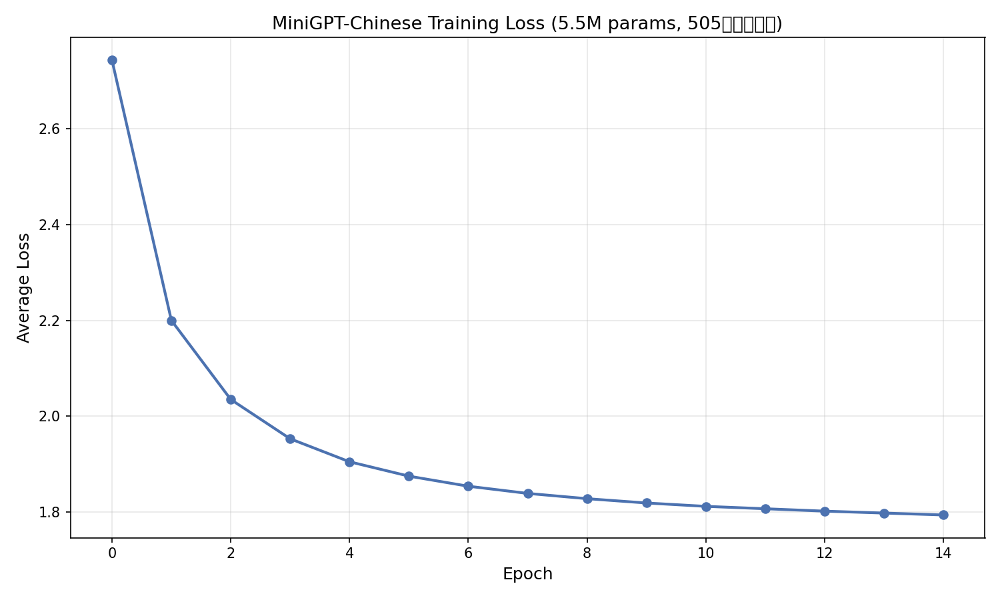

# MiniGPT-Chinese

从零用 PyTorch 实现的迷你中文 GPT 文本生成模型 —— 一个从"语料 → 自研分词器 → 模型 → 训练 → 生成"完整链路的中文语言模型项目。

## 🎯 项目简介

本项目从零实现了一个基于 Transformer 的字符级中文 GPT 模型，包括：
- **自研 BPE 分词器**（非使用现成库）：实现字节对编码（Byte Pair Encoding）的合并、编码、解码
- **从零实现 GPT 模型**：LayerNorm、位置编码、前馈网络、多头因果自注意力、主模型拼装
- **完整训练链路**：语料清洗 → BPE 分词 → 数据切片 → 训练 → 生成

**训练成果**：模型在约 500 万字中文语料（日式轻小说）上训练后，能生成符合语料风格的通顺中文对话。

## 📊 训练结果

**配置**：5.5M 参数（n_layer=6, n_head=8, n_embd=256），505 万字符语料，15 epoch

**训练曲线**：



**Loss 下降**：2.743 → 1.794（训练收敛正常）

## ✨ 生成效果示例

| 输入开头 | 模型生成 |
|---------|---------|
| 我真的 | 我真的只是喜欢若叶心怪怪的。不过你别笑我。 |
| 我喜欢你 | 我喜欢你。我还在期待。因为我也是喜欢你这身泳草的。 |
| 吃饭 | 吃饭的有什么问题吗？「若叶，今天就不去洗澡吧。…… |

## 🏗️ 项目结构

```
minigpt-chinese/
├── model/          # GPT 模型（从零实现）
│   ├── layers.py       # LayerNorm、位置编码、前馈网络
│   ├── attention.py    # 多头因果自注意力
│   └── gpt.py          # GPT 主模型
├── data/           # 数据模块
│   ├── tokenizer.py    # 自研 BPE 分词器
│   ├── dataset.py      # 数据集封装（滑动窗口切片）
│   └── prepare_corpus.py  # 语料清洗（GBK→UTF-8，去广告/版权）
├── train.py        # 训练脚本
├── generate.py     # 生成测试脚本
├── plot_loss.py    # 训练曲线可视化
├── tests/          # 测试（11个全过）
└── result/         # 训练成果（模型、分词器、曲线图）
```

## 🔬 技术要点

- **BPE 分词器**：字节级，反复合并"出现最多的相邻对"直到词表达标；`train/encode/decode` 三方法
- **GPT 模型**：token嵌入 → 位置编码 → N×Block(注意力+前馈+残差) → LayerNorm → 输出层
- **因果注意力**：下三角 mask 确保 token 只能看前面
- **训练**：AdamW、cross_entropy、batch 256、GPU 加速（AutoDL 4090）

## 🧪 测试

11 个测试全部通过（LayerNorm、注意力、GPT 结构、过拟合冒烟、BPE、数据集）：

```bash
python -m pytest tests/ -v
```

## 📅 项目状态

- [x] 阶段1：PyTorch 复习
- [x] 阶段2：从零写 GPT 模型
- [x] 阶段3：数据管线 + 自研 BPE tokenizer
- [x] 阶段4：训练 + 可视化（loss 曲线）
- [ ] 阶段5：实验体系（待做）
- [ ] 阶段6：后端 API + 前端页面（待做）
- [ ] 阶段7：部署上线 + 完整报告（待做）
