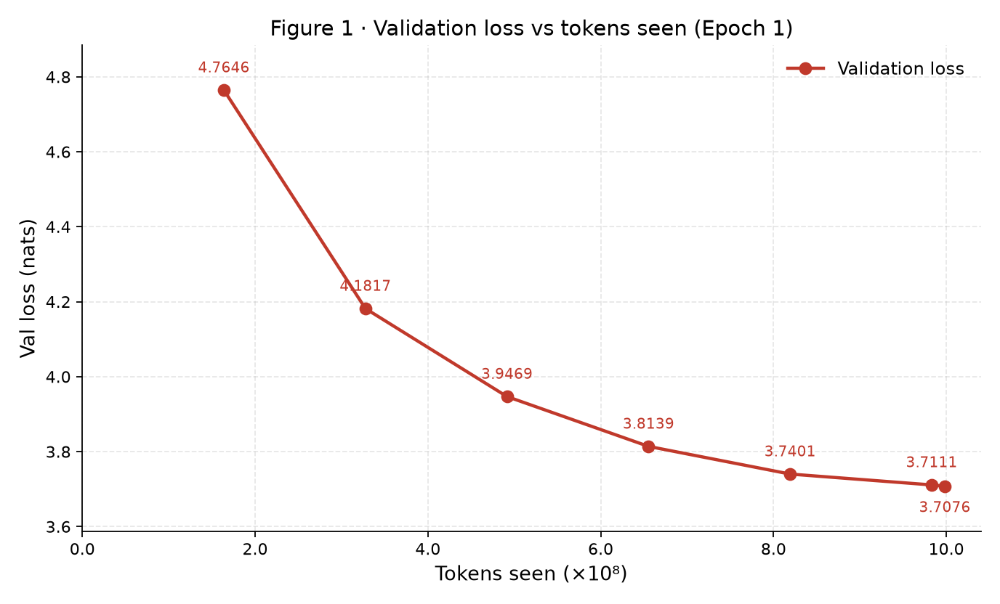
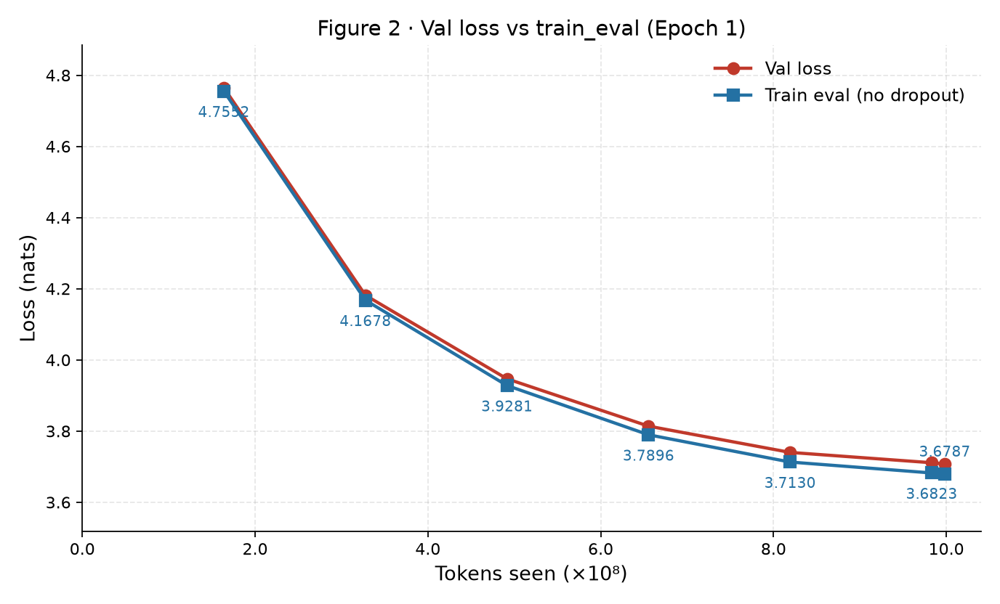
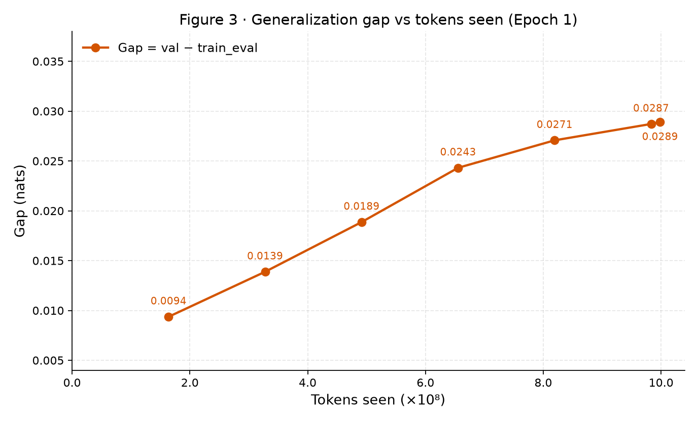
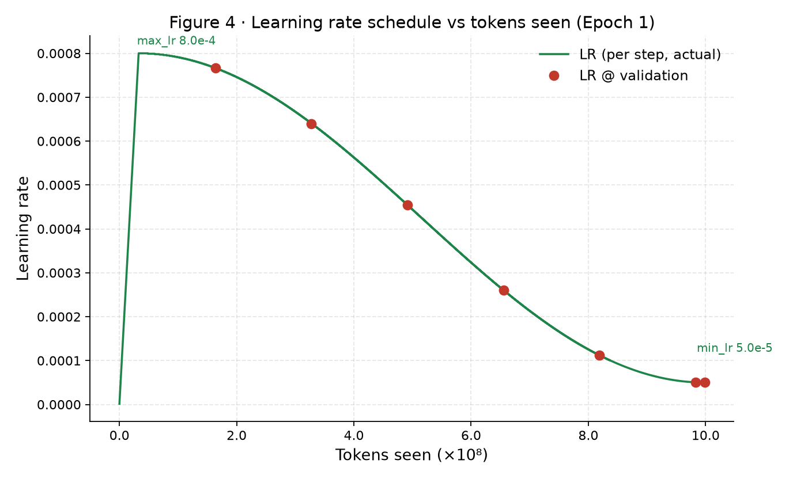
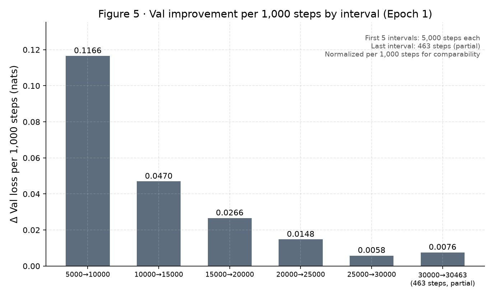

# MiniGPT-Chinese v2 35M / 1B WebNovel — Epoch 1 阶段实验报告

> **Interim Report（Epoch 1 阶段报告）**
>
> **STATUS：EPOCH 1 COMPLETE ｜ EPOCH 2 PENDING ｜ NOT FINAL MODEL REPORT**
>
> 本报告仅覆盖第一轮（Epoch 1）预训练阶段。是否进行 Epoch 2 将在训练诊断后决定，**本报告中的 3.7076 不代表 35M 模型的最终性能上限**。
>
> - Experiment ID：`v2_35M_ctx512_1B_E1`
> - 数据来源：`log/35M参数+998Mtokens/{val_history,step_history}_train_webnovel_v2.csv`、`train_webnovel_v2.log`、`run_config.txt`（全部为实际运行产物，无手工编造数值）
> - 报告日期：2026-09-05

---

## 0. 报告性质与结论边界

- 这是 **Epoch 1 阶段报告（Interim Report）**，不是最终 35M 模型报告。
- Epoch 2 尚未启动；是否继续训练取决于本轮诊断（见 §7 问题清单）。
- 任何关于 35M 模型"最终性能"的表述均不成立，本报告只描述 **第一轮已完成部分** 的证据与判断。

## 1. 实验概述

| 项 | 内容 |
|---|---|
| 目标 | v2 综合升级实验：20M→35M 模型 + ctx 256→512 + 语料 4.16 亿→~10 亿 token（B 组能力深度） |
| 本轮范围 | Epoch 1（1 轮 = 过完 ~998M 训练 token），共 30,463 步 |
| 计划配置 | `docs/experiment_config_v2.yaml`：**batch_size=128**（tokens/step=65,536，计划 total_steps=15,232） |
| 实际配置 | 真实成功运行：**batch_size=64**（tokens/step=32,768，total_steps=30,463）。首次配置为 batch128，随后实际成功运行配置调整为 batch64，总 token 不变 |
| 结论性质 | Epoch 1 完成；Epoch 2 待训练诊断后决定 |

> ⚠️ **batch 口径提醒**：`experiment_config_v2.yaml` 计划 batch=128，但本轮实际成功训练使用 **batch=64**（run_config.txt 两次启动记录：20:46:40 为 batch128 配置、20:48:25 为 batch64 实际运行配置）。**不得写成"batch=128 完成本轮训练"**。

## 2. 实际运行配置（以 run_config.txt 为准）

| 模块 | 项 | 实际值 |
|---|---|---|
| model | parameters | **34,676,736**（含 tie_embeddings 去重） |
| model | n_layer / n_head / n_embd | 10 / 8 / 512 |
| model | block_size | 512 |
| model | vocab_size / tie_embeddings / dropout | 6144 / true / 0.1 |
| data | train_tokens | 998,208,111 |
| data | val_tokens | 115,285,271 |
| data | mode / 缓存 | pack（不重叠）/ uint16 memmap token cache |
| data | train shards / val shards | 828 / 96 |
| training | batch_size（actual） | **64** |
| training | tokens_per_step（actual） | 32,768 |
| training | total_steps | 30,463 |
| training | epochs | 1 |
| training | max_lr / min_lr | 8e-4 / 5e-5 |
| training | warmup_steps | 1000 |
| training | weight_decay / grad_clip | 0.05 / 1.0 |
| training | val_every | 5000 |

配置来源：`run_config.txt` 第二次启动段（20:48:25）与 `train_webnovel_v2.log` 头段一致。日志确认：训练集 998,208,111 token、验证集 115,285,271 token、每批 64 → 每 epoch 30,463 步。

## 3. Epoch 1 核心实验数据（来自 val_history CSV）

| step | tokens_seen | val | train_eval | gap | lr | is_best | no_improve |
|---|---|---|---|---|---|---|---|
| 5000 | 163,840,000 | 4.7646 | 4.7552 | 0.0094 | 7.66e-4 | 1 | 0 |
| 10000 | 327,680,000 | 4.1817 | 4.1678 | 0.0139 | 6.40e-4 | 1 | 0 |
| 15000 | 491,520,000 | 3.9469 | 3.9281 | 0.0189 | 4.54e-4 | 1 | 0 |
| 20000 | 655,360,000 | 3.8139 | 3.7896 | 0.0243 | 2.60e-4 | 1 | 0 |
| 25000 | 819,200,000 | 3.7401 | 3.7130 | 0.0271 | 1.12e-4 | 1 | 0 |
| 30000 | 983,040,000 | 3.7111 | 3.6823 | 0.0287 | 5.05e-5 | 1 | 0 |
| **30463** | **998,211,584** | **3.7076** | **3.6787** | **0.0289** | 5.00e-5 | 1 | 0 |

- **Epoch 1 best：val_loss = 3.7076 @ step 30463（tokens_seen = 998,211,584）**
- **全部 7 次 validation 均刷新 best（is_best 恒为 1），no_improve 恒为 0，无早停触发**
- 说明：val_history CSV 内部将最后一行标记为 "epoch 0 结束"（0 起始计数），即本轮 Epoch 1 的终点；tokens_seen 由 step × 32,768 复算，末步 998,211,584 与日志一致。

> **tokens_seen 口径说明**：日志字段 logged tokens_seen = **998,211,584**（末步 30,463 × 32,768 复算一致）。而实际 pack 样本 1,949,625 × 512 = **998,208,000** token positions；二者相差 **3,584**，来自最后一个 partial batch 按完整 batch 计数（每步统一按 32,768 tokens 计入）。误差约 **0.00036%**，不影响实验结论。后续代码应改为 `tokens_seen += x.numel()` 精确累计。

## 4. 图表（简洁统一风格，数值全部来自实际 CSV）

### Figure 1 · Val loss vs tokens_seen



> **解读**：验证损失从 4.7646 持续下降至 3.7076（约 -1.057 nats），整条曲线单调收敛、无反弹；前 5 亿 token 贡献了绝大部分下降，后段趋缓（见 Figure 5）。

### Figure 2 · Train_eval vs Val loss



> **解读**：train_eval（无 dropout）与 val 同步下降（4.7552 → 3.6787），两条曲线保持近似平行且 val 始终略高于 train_eval，未见训练端单独快速下降的过拟合形态。

### Figure 3 · Generalization gap vs tokens_seen



> **解读**：gap = val − train_eval 从 0.0094 缓慢扩大至 0.0289，全程绝对值仍小（<0.03 nats），截至 Epoch 1 结束**没有明显过拟合证据**。

### Figure 4 · Learning Rate vs tokens_seen



> **解读**：LR 按 warmup 1000 步 + cosine 衰减从 8e-4 平滑降至 5e-5；7 个验证点对应 LR 与逐步曲线完全吻合，后半段 loss 变慢与 LR 进入 cosine 尾端在时间上重合。

### Figure 5 · Val improvement per 1,000 steps by interval



> **解读**：末区间（30000→30463）仅 463 步，与前五个 5,000 步区间长度不同，**不可直接比较绝对改善量**；本图统一按每 1,000 步标准化（Δ val / 区间步长 × 1000）：0.1166 / 0.0470 / 0.0266 / 0.0148 / 0.0058 / 0.0076（末区间为 partial interval）。整体改善强度持续衰减，且与 LR 同步衰减至 5e-5 重合，**不能把下降变慢单独归因于模型容量耗尽**；末区间按步长标准化后（0.0076 / 1k steps）并未低于 25k→30k（0.0058 / 1k steps），说明 Epoch 1 结束时训练尚未完全停滞。

## 5. 核心结论

1. **Epoch 1 训练稳定完成**：30,463 步无中断，无 NaN/发散迹象，7 次验证全部刷新 best。
2. **Validation loss 持续改善**：4.7646 → 3.7076（-1.057 nats）。
3. **Train_eval 持续改善**：4.7552 → 3.6787（-1.076 nats）。
4. **Generalization gap 缓慢扩大但保持较小**：0.0094 → 0.0289；截至 Epoch 1 结束**没有明显过拟合证据**。
5. **后半段 val 改善速度明显下降**（5k→10k: -0.5829 → 25k→30k: -0.0290），但 LR 同时进入 cosine 尾端（7.66e-4 → 5e-5），**因此不能把 loss 下降变慢单独解释为模型容量耗尽**。
6. **最后 463 步仍有轻微改善**（3.7111 → 3.7076，-0.0035），说明第一轮结束时 validation 仍在改善。
7. **对 Epoch 2 的判断**：根据当前证据，当前曲线**支持进行 Epoch 2 继续训练实验**；但第二轮收益预计明显低于第一轮（改善曲线已呈明显衰减）。**不写"必须第二轮"**。

## 6. 训练效率

| 项 | 值 |
|---|---|
| 实际训练时长 | 约 **1 小时 28 分 49 秒**（tqdm：1:28:49，5.72 step/s） |
| 平均速度 | 约 **5.72 step/s** |
| tokens/step | 32,768（batch=64 × block=512） |
| 估算训练吞吐 | 约 **187k tokens/s**（5.72 × 32,768 ≈ 187,433；为近似平均吞吐） |

## 7. 必须记录的问题

### A. Scheduler warning（Engineering Issue / Pending Fix）

训练启动时日志出现：

```
UserWarning: Detected call of `lr_scheduler.step()` before `optimizer.step()`.
In PyTorch 1.1.0 and later, you should call them in the opposite order:
`optimizer.step()` before `lr_scheduler.step()`.
```

- 影响评估：**未破坏本轮训练结果**。Epoch 1 已完成、曲线正常（LR 记录与预期 schedule 一致，7 个验证点 LR 均符合 warmup+cosine）。
- **根因尚未确认**。已审查 train.py，源码调用顺序本身为：
  `scaler.step(optimizer)` → `scaler.update()` → `scheduler.step()`
  即源码顺序并无明显错误。优先怀疑：**AMP GradScaler 因初始 overflow 跳过 optimizer update（`scaler.step()` 内部未执行优化），而 `scheduler.step()` 仍照常推进**。
- 待办：Epoch 2 前通过 **skipped-step 检测**（检查 scaler 是否连续 skip / optimizer 实际未更新步数）与 **dry-run** 确认根因，再决定是否需要改动。

### B. Resume 与 LR（Epoch 2 启动前必须检查）

当前项目 resume 会涉及 cosine scheduler 重新锚定（warm restart，LR 跳回，见 MiniGPT_Project_Status 坑点 4）。Epoch 2 启动前必须逐项检查：

- [ ] checkpoint epoch
- [ ] global_step
- [ ] tokens_seen
- [ ] optimizer state（AdamW 动量/方差）
- [ ] scheduler state
- [ ] resume 后的初始 LR
- [ ] 第二轮 LR schedule（不得默认第二轮直接沿用任何 LR 方案）

### C. YAML vs Actual（配置漂移）

| 项 | planned（experiment_config_v2.yaml） | actual（本轮成功运行） |
|---|---|---|
| batch_size | 128 | **64** |
| tokens_per_step | 65,536 | 32,768 |
| total_steps | 15,232 | 30,463 |

> 配置调整说明：run_config.txt 记录首次启动（20:46:40）为 batch128 配置，随后实际成功运行配置（20:48:25）调整为 batch64。**训练日志中无 CUDA OOM / out of memory 记录，故不主张 OOM 为调整原因**，仅记录配置差异本身。
>
> 后续项目状态文件必须**以实际训练配置为准**。

## 8. 历史模型比较（谨慎处理）

| 模型 | 评估空间 | best val |
|---|---|---|
| 20M old model（v1 时代） | 旧 tokenizer / 旧语料 / 旧 val 集 / ctx256 | 3.636 |
| 35M v2 Epoch 1 | 新 tokenizer / 新语料 webnovel_v2 / 新 val 集 / ctx512 | 3.7076 |

> ⚠️ **不能直接比较两者 raw val_loss**。原因：
> 1. 新语料（webnovel_v2 shard0）
> 2. 新 tokenizer
> 3. 新 validation set（按书划分，与旧 val 集不同）
> 4. context 变化（256 → 512）
>
> 因此**禁止得出"35M 不如 20M"或"35M 已经超过 20M"的结论**。两者 raw loss 处于**不同评估空间**。真正的 35M 性能判断应基于：
> - v2 自身训练趋势（本轮已展示：稳定收敛）
> - 相同 tokenizer / validation 下的对照实验（暂无数据）
> - 后续生成质量评估

## 9. 最终结论

> 35M v2 在约 998M 训练 token 的首轮预训练中表现出稳定收敛。Validation loss 从 4.7646 持续下降至 3.7076，所有验证点均刷新最佳结果；train_eval 与 validation 同步下降，generalization gap 最终为 0.0289，当前没有明显过拟合信号。训练后半段改善速度下降，但与 cosine 学习率同步衰减至 5e-5 重合，因此尚不能判定达到模型容量上限。当前结果支持在检查 resume 及 LR scheduler 行为后进行 Epoch 2 继续训练实验。

```
STATUS:
  EPOCH 1 COMPLETE
  EPOCH 2 PENDING
  NOT FINAL MODEL REPORT
```

## 10. 附：Epoch 2 前置检查清单（训练诊断）

1. 按 §7-A 通过 **skipped-step 检测与 dry-run** 确认 scheduler warning 根因（优先检查 AMP GradScaler 初始 overflow 是否跳过 optimizer update 而 scheduler 仍 step）。
2. 按 §7-B 清单核对 checkpoint 与 resume 后 LR schedule，确认第二轮 LR 方案（是否沿用 cosine 重新锚定或改用新计划）。
3. 以 batch=64 / tokens_per_step=32,768 / total_steps 视第二轮计划为准，更新 `run_config.txt` 与状态文件，避免 YAML 与实际的 batch 口径继续漂移。
4. 继续监控 gap（当前 0.0289）；若 Epoch 2 中 gap 明显加速扩大，再评估过拟合与早停。
