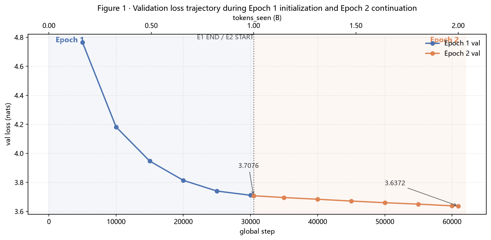
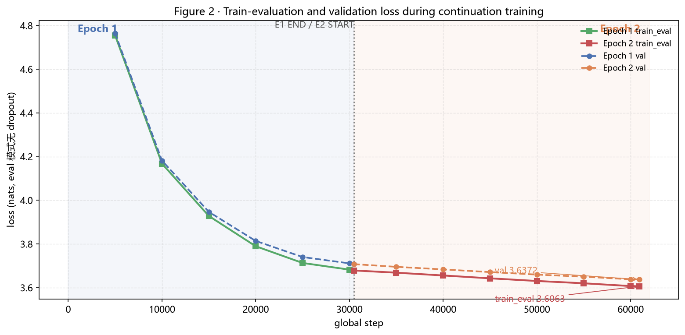
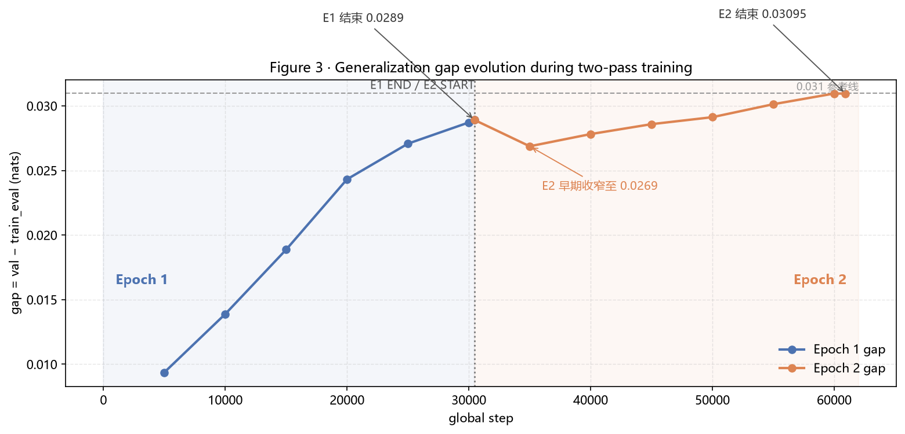
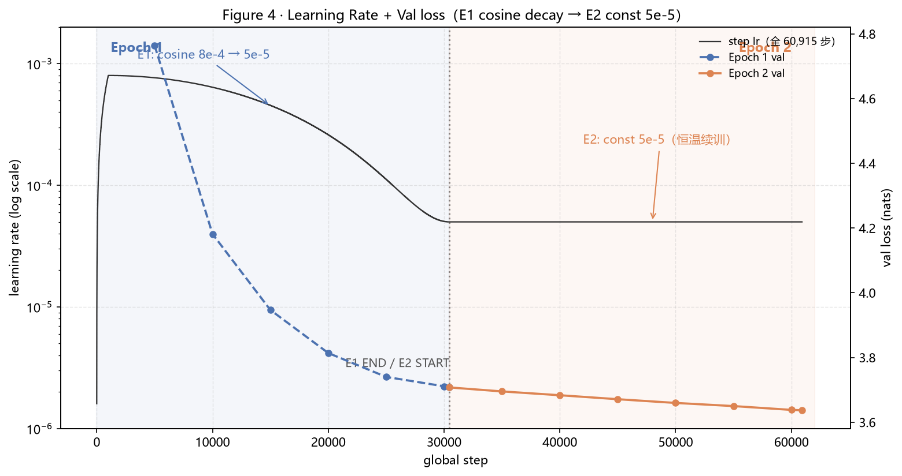

# MiniGPT-Chinese v2 35M / 1B WebNovel — Epoch 1+2 阶段训练总结

> **Stage Summary（35M 当前训练阶段收官总结）**
>
> **STATUS：35M V2 EPOCH 2 COMPLETE ｜ CURRENT V2 BEST = 3.6372 ｜ NO OBVIOUS OVERFITTING BEHAVIOR ｜ EPOCH 3 NOT YET APPROVED ｜ NEXT = GENERATION EVALUATION / OPTIONAL E3 PROBE**
>
> 本报告是 35M v2 模型在 **Epoch 1 + Epoch 2 continuation** 两轮训练完成后的阶段收官总结，不是重新写一篇冗长的项目总报告。
>
> - Experiment ID：`v2_35M_ctx512_1B_E1` + `v2_35M_ctx512_1B_E2`
> - 数据来源：`log/35M参数+998Mtokens/{val_history,step_history}_train_webnovel_v2.csv`、`run_config.txt`、`train_webnovel_v2_e2.log`（全部为实际运行产物，**无手工编造数值**）
> - 报告日期：2026-09-06

---

## 0. 报告性质与结论边界

- 这是 **35M v2 的 Epoch 1 + Epoch 2 两轮收官总结**（同语料二遍，累计 ≈2B token），只覆盖这一个实验的完整两轮。
- 所有数值以实际日志（CSV / run_config / 训练日志）为唯一依据，未补任何数字。
- 涉及 Epoch 1（step 1 → 30,463）与 Epoch 2 continuation（step 30,464 → 60,915）两段，E2 为独立 run，从 E1 结束 checkpoint resume。

## 1. 实验阶段（明确）

### 1.1 模型

| 项 | 值 |
|---|---|
| parameters | **34,676,736**（含 tie_embeddings 去重） |
| n_layer | 10 |
| n_head | 8 |
| n_embd（d_model） | 512 |
| block_size（ctx） | 512 |
| vocab_size | 6144 |
| tie_embeddings | true |
| dropout | 0.1 |

### 1.2 数据

| 项 | 值 |
|---|---|
| train tokens | ≈ **998.208M**（998,208,111，unique token stream） |
| val tokens | ≈ **115.285M**（115,285,271） |
| mode | pack（不重叠） |
| batch_size（actual） | **64** |
| tokens/step（actual） | **32,768** |

### 1.3 本次完整训练包含

- **Epoch 1**：step 1 → 30,463（warmup 1000 + cosine 8e-4 → 5e-5）
- **Epoch 2 continuation**：step 30,464 → 60,915（const 5e-5 恒温续训，resume 自 E1 checkpoint）
- 累计 token exposure ≈ **1,996M**（≈2B token exposure）。其中：
  - **Epoch 1**：首次遍历训练语料，约 998M tokens；
  - **Epoch 2**：在相同训练语料上进行第二次遍历，再次暴露约 998M tokens。
- **注意**：这里表示模型累计看到的 token 数量（**token exposure**），**不是 2B unique tokens**。本实验实际使用约 998M 规模训练语料，通过多 epoch continuation 进行重复学习。

## 2. Epoch 1 结果

**Epoch 1 终点**：step = 30,463 ｜ val = **3.7076** ｜ train_eval = **3.6786727** ｜ gap = **0.0289108** ｜ lr = **5e-5**

| step | tokens_seen | val | train_eval | gap | lr |
|---|---|---|---|---|---|
| 5000 | 163,840,000 | 4.7646 | 4.7552 | 0.0094 | 7.66e-4 |
| 10000 | 327,680,000 | 4.1817 | 4.1678 | 0.0139 | 6.40e-4 |
| 15000 | 491,520,000 | 3.9469 | 3.9281 | 0.0189 | 4.54e-4 |
| 20000 | 655,360,000 | 3.8139 | 3.7896 | 0.0243 | 2.60e-4 |
| 25000 | 819,200,000 | 3.7401 | 3.7130 | 0.0271 | 1.12e-4 |
| 30000 | 983,040,000 | 3.7111 | 3.6823 | 0.0287 | 5.05e-5 |
| **30463** | **998,211,584** | **3.7076** | **3.6787** | **0.0289** | **5.00e-5** |

**Epoch 1 特征**：
- **所有 validation 刷新 best**：7 次验证 is_best 恒为 1、no_improve 恒为 0，无早停触发。
- **无明显过拟合**：gap 终点仅 0.0289。
- **后期 LR 下降至 5e-5**（cosine 尾端）。
- **val 仍在下降**：最后 463 步（30000 → 30463）val 从 3.7111 → 3.7076，仍在下行。

## 3. Epoch 2 实际训练策略（必须明确）

Epoch 2 **从 step = 30,463 处 resume**，实际使用：

| 项 | 值 |
|---|---|
| resume_from_step | **30,463**（checkpoint `next_epoch=1` → 只跑第二轮，未重跑 epoch 0；E2 日志进度条为 "Epoch 1"） |
| batch_size | **64** |
| tokens/step | 32,768 |
| lr_scheme | **const** |
| lr | **5e-5（恒定）** |
| total_steps（理论） | 60,926（实际到 60,915 自然结束，见 §9） |

> ⚠️ **必须明确**：第二轮**不是重新 warmup 到 8e-4**，**也不是重新运行完整 cosine**。它是在第一轮结束 checkpoint 基础上，使用**固定 5e-5 低学习率继续训练**。

依据：
- `run_config.txt` 第三段（2026-09-06 12:19:29）：`lr_scheme: const`、`lr: 0.0008`（仅作 const 方案基准，实际恒 min_lr 5e-5）。
- E2 训练日志头部：`LR 方案: const（恒 5.00e-05，continuation 用，不重铺 cosine）`。
- `step_history` E2 段 lr 列**全程 5.00e-05**（step 30,464 → 60,915 无任何突跳）。
- 背景：`docs/RESUME_AUDIT.md` 确认原 resume 会把 cosine 重铺（5e-5 → 4.35e-4，×8.7 隐式跳变），本轮按「方案 1 恒温续训」实施（`--lr-scheme const`），彻底消除该风险。

## 4. Epoch 2 验证数据（CSV 实际数据）

| step | tokens_seen | val | train_eval | gap | lr |
|---|---|---|---|---|---|
| 35000 | 1,146,880,000 | **3.6953** | 3.668456 | 0.026872 | 5e-5 |
| 40000 | 1,310,720,000 | **3.6835** | 3.655697 | 0.027815 | 5e-5 |
| 45000 | 1,474,560,000 | **3.6712** | 3.642615 | 0.028584 | 5e-5 |
| 50000 | 1,638,400,000 | **3.6597** | 3.630528 | 0.029125 | 5e-5 |
| 55000 | 1,802,240,000 | **3.6500** | 3.619900 | 0.030127 | 5e-5 |
| 60000 | 1,966,080,000 | **3.6382** | 3.607234 | 0.030955 | 5e-5 |
| **60915** | **1,996,059,136** | **3.6372** | **3.606269** | **0.030953** | **5e-5** |

**Epoch 2 结束**：step = 60,915 ｜ val = **3.6372** ｜ train_eval = **3.606269** ｜ gap = **0.030953** ｜ lr = **5e-5**

- E2 全部 7 次验证仍刷新 best（is_best 恒 1，no_improve 恒 0）。
- E2 平均 train loss 3.777（EMA 3.740，日志记录）。
- 训练时长：12:18 → 13:49（约 1 小时 30 分，5.7 step/s）。

## 5. 必须计算和解释的核心结果

**Epoch 1 → Epoch 2：**

| 指标 | E1 结束 | E2 结束 | 变化 |
|---|---|---|---|
| val | 3.7076 | **3.6372** | **下降 0.0704 nats** |
| gap | 0.02891 | 0.03095 | 仅增加约 **0.00204** |

**相对 PPL 变化（辅助指标）**：

```
exp(3.7076) ≈ 40.76
exp(3.6372) ≈ 37.99
相对下降 ≈ (40.76 − 37.99) / 40.76 ≈ 6.8%
```

> ⚠️ **PPL 只用于同一个 v2 tokenizer / validation set 内部比较**，不用于任何跨评估空间的排名。

**正确结论**：第二轮产生了**明确、稳定**的 validation 收益（-0.0704 nats / 相对 PPL -6.8%），而 generalization gap **仅轻微增加（+0.00204）**，因此**没有明显过拟合迹象**。

## 6. 分析第二轮下降速度

**不要只写"第二轮下降变慢"，必须区分两轮的性质差异：**

- **第一轮**：从随机初始化建立基础语言建模能力，loss 下降幅度非常大（E1 val 4.7646 → 3.7076，约 -1.057 nats / 30,463 步）。
- **第二轮**：已经是在成熟 checkpoint 基础上继续优化，**边际收益自然下降**（E2 val 3.7076 → 3.6372，约 -0.0704 nats / 30,452 步）。

**第二轮内部每 5,000 步改善（val，来自 CSV）：**

| 区间 | Δval |
|---|---|
| 30463 → 35000 | **0.0123** |
| 35000 → 40000 | **0.0118** |
| 40000 → 45000 | **0.0123** |
| 45000 → 50000 | **0.0115** |
| 50000 → 55000 | **0.0097** |
| 55000 → 60000 | **0.0118** |
| （60000 → 60915，463 步） | 0.0010 |

**结论**：第二轮内部每 5,000 步的改善幅度**相当稳定**（0.0097 – 0.0123 的窄区间），**没有出现明显的快速衰竭**。

- ❌ 不能写："模型已经基本学不动。"
- ✅ 更准确："**相对于 Epoch 1，Epoch 2 进入低边际收益阶段；但 Epoch 2 内部仍保持稳定改善。**"

## 7. Gap 分析

**重点画出 Epoch 1 + Epoch 2 全程 gap 曲线（Figure 3）。**

| 位置 | gap |
|---|---|
| E1 结束（step 30463） | 0.0289 |
| E2 早期（step 35000） | **下降到 0.0269** |
| step 40000 | 0.0278 |
| step 45000 | 0.0286 |
| step 50000 | 0.0291 |
| step 55000 | 0.0301 |
| step 60000 | 0.0310 |
| E2 结束（step 60915） | **0.03095** |

**正确解释**：
1. **gap 没有快速发散**：E2 结束时 0.031，相比 E1 结束 0.0289 仅微增。
2. **train_eval 和 val 同步下降**（Figure 2）：不是训练端单独快速下降的过拟合形态。
3. **E2 结束时 gap 基本稳定在 0.031 附近**。
4. **当前没有明显过拟合证据**。

> 禁止使用固定阈值表述（如"gap < 0.05 一定安全"）。本报告只做趋势判断，不设定机械安全线。

## 8. 核心图（4 张）

> 图例数值全部来自实际 CSV，风格与 E1 阶段报告统一；仅保留 4 张，不重复堆图。

### Figure 1 · Validation loss trajectory during Epoch 1 initialization and Epoch 2 continuation



> 竖虚线标记 **E1 END / E2 START**（step 30,463）。E1（蓝）从 4.7646 快速降至 3.7076；E2（橙）从 3.7076 继续稳定降至 **3.6372**。两条曲线均为单调收敛，无反弹。

### Figure 2 · Train-evaluation and validation loss during continuation training



> train_eval 与 val 全程同步下降（train_eval 4.7552 → 3.6063；val 4.7646 → 3.6372），两条曲线保持近似平行，val 始终略高于 train_eval；E2 结束 gap = 0.031。

### Figure 3 · Generalization gap evolution during two-pass training



> gap 从 E1 早期 0.0094 缓慢扩大到 E1 结束 0.0289；E2 早期一度收窄至 0.0269，随后逐步回升至 E2 结束 **0.03095**。全程绝对值小、无发散，**没有明显过拟合证据**。

### Figure 4 · Learning Rate + Val loss



> 清楚展示 **E1 cosine decay（8e-4 → 5e-5）→ E2 const 5e-5（恒温续训）**。竖虚线标记 **E1 END / E2 START**；E2 段 lr 列全程 5.00e-5（无 4.35e-4 突跳），val 在恒定低学习率下继续稳定下降。

## 9. 关于 60,915 vs 60,926（步数口径）

- `run_config` 理论 total_steps = **60,926**（batch64 × 2 epoch 的理论上限）。
- 实际 Epoch 2 终点记录为 **60,915**（val_history 末行；E2 日志 "已完成 60915/60926 步"）。
- **差异 = 11 步。**

**直接证据**：`train_webnovel_v2_e2.log` 明确记录 **"AMP skipped 11 步"**（epoch 结束行与 tokens_seen 合计行均有），11 步差异与该计数完全吻合。

**机制说明**（`docs/RESUME_AUDIT.md` §3-C 修复）：修复后**仅当 optimizer 确实完成参数更新才推进** global_step / scheduler / tokens_seen；AMP（GradScaler）跳过 optimizer.step 的步不推进进度 → 理论基线（60,926）与实际完成步数（60,915）之差 = skipped 计数。

**严谨表述**：
- 日志记录 AMP skipped optimizer steps = **11**，步数差异由此完整解释。
- 每一被跳过步的具体 overflow 事件**未逐步记录**，因此不主张"发生 11 次 AMP overflow"这一表述，只记录日志所载事实。

```
Training-step accounting difference: 11 steps
（= AMP skipped optimizer steps per training log；per-step overflow detail not logged）
```

## 10. 历史 20M 比较（谨慎处理）

| 模型 | 评估空间 | best val |
|---|---|---|
| 20M old best | 旧 tokenizer / 旧语料 / 旧 val 集 / ctx256 | 3.636 |
| 35M v2 E2 | 新 tokenizer / webnovel_v2 / 新 val 集 / ctx512 | **3.6372** |

> ⚠️ **这两个数字不能直接比较**，因为：
> 1. tokenizer 不同
> 2. validation 不同
> 3. data 不同
> 4. ctx 不同
>
> 禁止写"35M 已经追平 20M"。
> 可以说：**"数值接近，但属于不同 evaluation space，不具有直接排名意义。"**

## 11. 当前阶段判断

1. **Epoch 1 训练有效**：30,463 步稳定收敛，val 4.7646 → 3.7076，全部验证刷新 best。
2. **Epoch 2 continuation 明确有效**：const 5e-5 恒温续训下 val 3.7076 → 3.6372。
3. **第二轮 val 改善 0.0704**（相对 PPL ≈ -6.8%）。
4. **gap 基本稳定（0.0289 → 0.0310）**：**当前未观察到明显的过拟合行为（no obvious overfitting behavior）**。需要注意：generalization gap 从 0.0289 轻微增加至 0.0310，说明模型泛化差距存在小幅扩大，但没有出现 validation loss 停止下降、train_eval 继续快速下降的典型过拟合模式。因此当前判断基于趋势，而不是基于固定 gap 阈值。
5. **目前尚无证据证明模型达到容量极限**：E2 内部每 5,000 步仍保持 0.0097 – 0.0123 的稳定改善。
6. **但继续完整 Epoch 3 的边际收益未知**（同数据第二遍已现 gap 微增、收益递减趋势）。

**因此：暂时冻结 Epoch 2 checkpoint 作为 35M v2 阶段最佳模型**（`checkpoint_best.pt`，val 3.6372）。

**下一阶段建议按以下顺序：**

- **A. 冻结当前 Epoch 2 checkpoint 作为 35M v2 阶段最佳模型。**
- **B. 进行生成质量对比评估**：比较 **35M v2 Epoch 1 checkpoint** vs **35M v2 Epoch 2 checkpoint**。
  - 保持相同条件：相同 prompt、相同 temperature、相同 top-k/top-p、相同 max_new_tokens、固定随机 seed。
  - 评价维度：中文流畅度、长文本稳定性、重复率、情节连续性、生成一致性。
- **C. 若生成质量提升明显，再进行 E3 probe**：
  - 不立即完整训练 1B token；
  - 先测试 **5,000 successful optimizer steps**；
  - 观察：**val 下降幅度、gap 变化、generation 质量变化**；
  - 再决定是否继续完整 Epoch 3。

## 12. 项目文档更新

- **`docs/EXPERIMENT_LOG.md`**：已含 `v2_35M_ctx512_1B_E2` 阶段记录，字段核验如下：
  - resume step：**30,463**（next_epoch=1，未重跑 epoch 0）✓
  - lr scheme：**const 5e-5**（恒温，不重铺 cosine）✓
  - final step：**60,915** ✓
  - final val：**3.6372** ✓
  - final train_eval：**3.606** ✓
  - final gap：**+0.031** ✓
  - improvement vs E1：**-0.0704**（3.7076 → 3.6372）✓
  - training duration：**12:18 → 13:49（~1:30）** ✓
  - current status：**Epoch 2 complete** ✓
- **`docs/MiniGPT_Project_Status.md`**：当前 v2 best 更新为 **35M v2 Epoch 2，val=3.6372 / train_eval=3.6063 / gap=0.0310**，并注明：**这是 v2 evaluation space 中的 best，不能与旧 20M raw loss 直接排名**。

## 13. 35M v2 Epoch1+Epoch2 实验总结

**本阶段完成了：**
- 34.7M 参数规模模型训练；
- 约 998M token 语料两轮 continuation 训练；
- pack 数据模式验证；
- resume 训练流程验证；
- cosine decay 到 const 低学习率续训验证。

**主要结果：**

| 项 | 值 |
|---|---|
| Epoch 1 | val = **3.7076** |
| Epoch 2 | val = **3.6372** |
| 第二轮额外降低 | **0.0704 nats** |
| gap | 0.0289 → 0.0310 |

模型仍保持稳定收敛。当前 35M v2 checkpoint 作为后续实验基准。

## 14. 最终状态

```
STATUS:
  35M V2 EPOCH 2 COMPLETE
  CURRENT V2 BEST = 3.6372
  NO OBVIOUS OVERFITTING BEHAVIOR
  EPOCH 3 NOT YET APPROVED
  NEXT = GENERATION EVALUATION / OPTIONAL E3 PROBE
```

## 15. 附：完整 val_history（14 个验证点，全部来自 CSV）

| step | 标记 | val | train_eval | gap | lr | is_best |
|---|---|---|---|---|---|---|
| 5000 | step 5000 | 4.7646 | 4.7552 | 0.0094 | 7.66e-4 | 1 |
| 10000 | step 10000 | 4.1817 | 4.1678 | 0.0139 | 6.40e-4 | 1 |
| 15000 | step 15000 | 3.9469 | 3.9281 | 0.0189 | 4.54e-4 | 1 |
| 20000 | step 20000 | 3.8139 | 3.7896 | 0.0243 | 2.60e-4 | 1 |
| 25000 | step 25000 | 3.7401 | 3.7130 | 0.0271 | 1.12e-4 | 1 |
| 30000 | step 30000 | 3.7111 | 3.6823 | 0.0287 | 5.05e-5 | 1 |
| 30463 | **E1 结束** | **3.7076** | **3.6786727** | **0.0289108** | 5.00e-5 | 1 |
| 35000 | step 35000 | 3.6953 | 3.668456 | 0.026872 | 5.00e-5 | 1 |
| 40000 | step 40000 | 3.6835 | 3.655697 | 0.027815 | 5.00e-5 | 1 |
| 45000 | step 45000 | 3.6712 | 3.642615 | 0.028584 | 5.00e-5 | 1 |
| 50000 | step 50000 | 3.6597 | 3.630528 | 0.029125 | 5.00e-5 | 1 |
| 55000 | step 55000 | 3.6500 | 3.619900 | 0.030127 | 5.00e-5 | 1 |
| 60000 | step 60000 | 3.6382 | 3.607234 | 0.030955 | 5.00e-5 | 1 |
| 60915 | **E2 结束** | **3.6372** | **3.606269** | **0.030953** | 5.00e-5 | 1 |

> tokens_seen 口径：E1 段为 step × 32,768（与 E1 阶段报告一致）；E2 段为精确累计（修复 D），末步 1,996,059,136 与日志一致。
